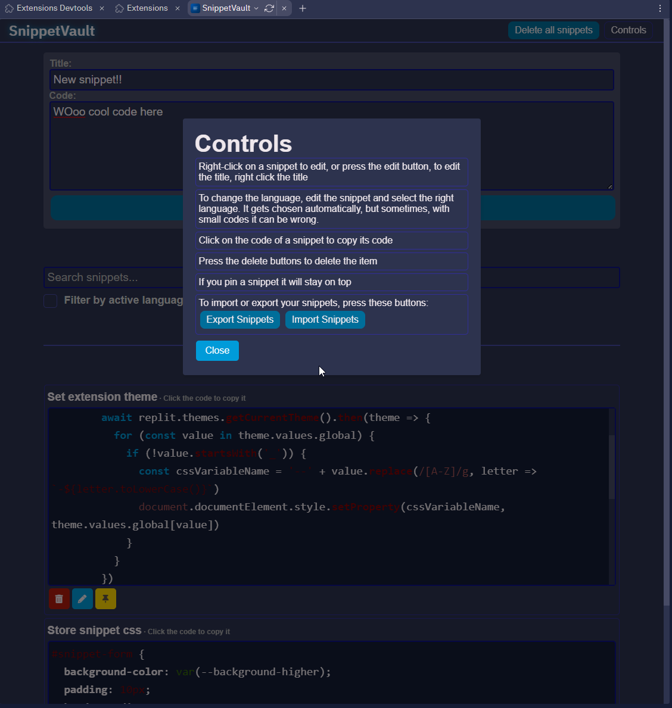

Stay on top of your tasks with SnippetVault, the successor to the Todo Extension. This upgraded version features user-wide code snippets, an improved UI, enhanced functionality, and no file creation in your repl. All data is stored in your localStorage, which is better than before, saving space in your repl and providing more secure content storage.\n\n\nUsage:\n1. Click a snippet to copy it, right-click to edit it.\n2. Click a note to mark it as done, click again to undo.\n3. Use the provided buttons for additional functionality.\n"

